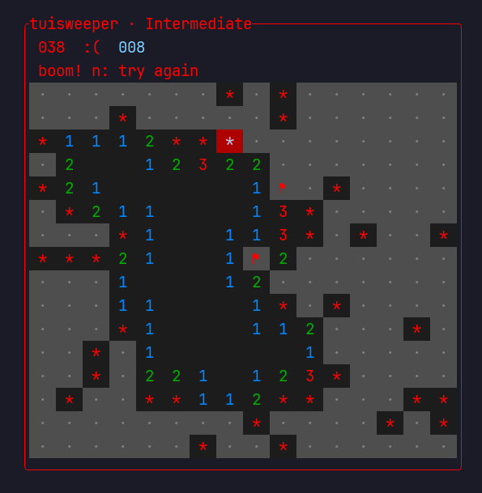

# tuisweeper

A single-player terminal Minesweeper clone built with [SpectreTuff](https://github.com/EluciusFTW/SpectreTuff)
(Spectre.Tui) and Elmish.



## Running / Installing

Requires the [.NET 10 SDK](https://dotnet.microsoft.com/download). You can run directly from source:

```sh
cd src && dotnet run
```

Alternatively, use the included scripts to build a
single-file, framework-dependent executable and copy it onto your `PATH` as `tuisweeper`.

**Linux / macOS:**

```bash
./scripts/install.sh             # installs to ~/.local/bin (or $TUISWEEPER_INSTALL_DIR)
./scripts/install.sh /custom/dir # or a custom directory
```

**Windows (PowerShell):**

```powershell
scripts\install.ps1                      # installs to %LOCALAPPDATA%\Programs\tuisweeper
scripts\install.ps1 -InstallDir C:\tools # or a custom directory
```

If the chosen directory is not already on your `PATH`, the script prints how to add it.

| Key                    | Action                                                                         |
| ---------------------- | ------------------------------------------------------------------------------ |
| ←↑↓→ / `h` `j` `k` `l` | move cursor                                                                    |
| `Space` / `Enter`      | reveal; on a number with all its mines flagged, reveals the neighbours (chord) |
| `f`                    | toggle flag                                                                    |
| `n`                    | new game                                                                       |
| `1` `2` `3`            | Beginner (9×9, 10) · Intermediate (16×16, 40) · Expert (30×16, 99)             |
| `q`                    | quit                                                                           |

The first reveal is always safe: mines are placed after it, away from the clicked cell.
Goal is to reveal all safe squares - mines do not have to be flagged.

## License

[MIT](LICENSE.md)
